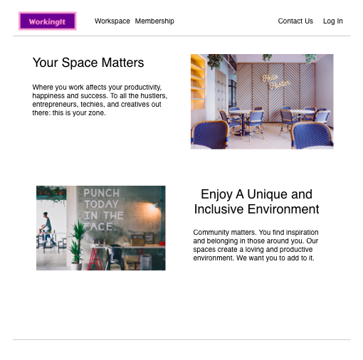
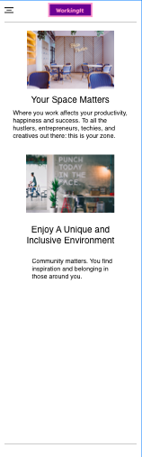
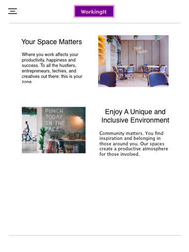
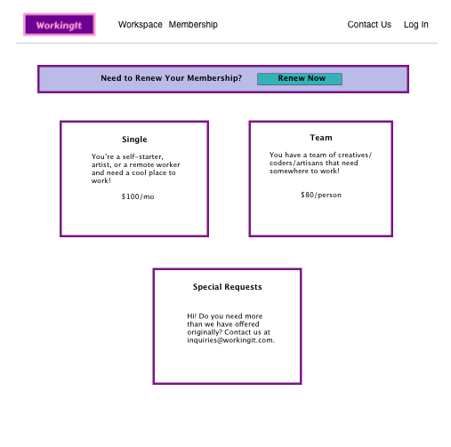
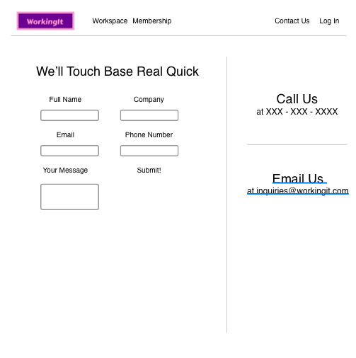
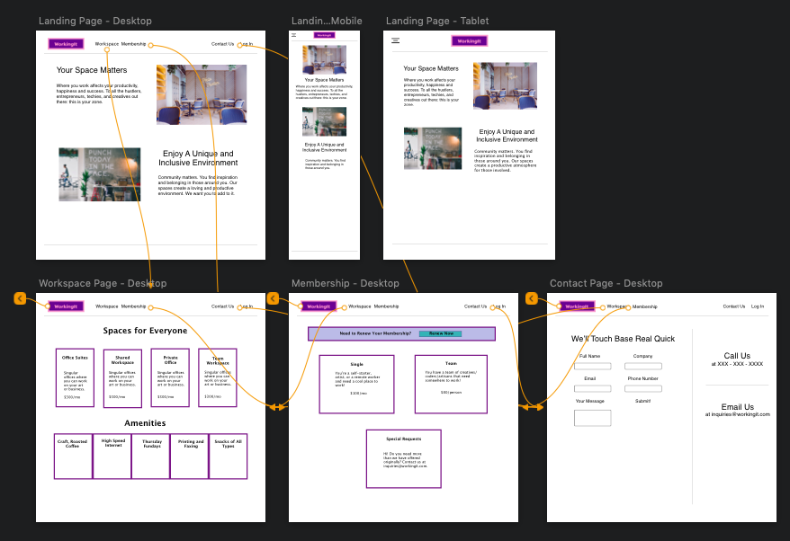
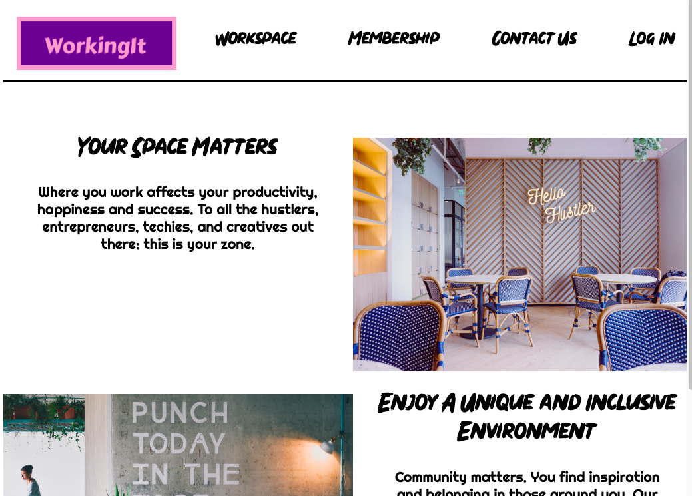
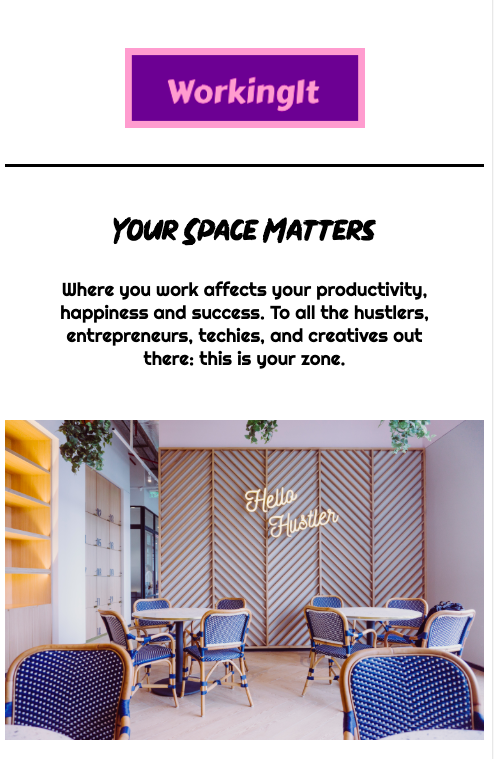

## Coworking Space Web Design
---

#### Dino Nguyen
#### 2/22/19

### Description

Do the web design process (user stories, sketching, wireframing, prototyping, and web development) for a coworking space company, WorkingIt. The website will convey to potential customers the feeling of being hip, luxurious, and inclusive.

### Images

Sketches

Wireframe

Prototype

#### Desktop Version

#### Mobile Version

### Personas

* Target users: potential members of the co-working space (freelancers, entrepreneurs and their employees, remote workers, creatives), co-working management

#### Teddy
##### "As a remote programmer, I need a nice workspace to do my work and not be distracted."
###### Needs
* _Informative website_
* _A workspace with offices and nice amenities_

###### Pain Points
* _Workspace with no areas to focus_
* _website with little information_

###### How we can serve
* _Make it minimalistic and informative_
* _Show the amenities provided_

#### Lisa
##### "I'm a creative and I want to find inspiration in those around me."
###### Needs
* _A space for creativity_
* _Sense of community_

###### Pain Points
* _Workspaces with no communal spaces_
* _A space that has no areas for entertainment and creativity_

###### How we can serve
* _Display the type of communal and engaging events that are offered_
* _Have pictures of the workspaces_
* User persona: Tanya - "I need a workspace for my startup." - Tanya wants to find a workspace that can host her startup and provide the usual amenities for a startup.
#### Tanya
##### "As an entrepreneur, I want a vibrant workspace where my employees can be productive but free"
###### Needs
* _A set of offices that are not too distracting and not too corporate_
* _A clean website showing off where the employees will be working_

###### Pain Points
* _Information overload_

###### How we can serve
* _Showcase the enterprise options_

### User Stories

* As a member of the co-working startup, I want a hip, luxurious, and inclusive website that draws attention to our sense of community.  
* As an aspiring member of this co-working space, I want to see an organized list of the amenities provided and the subscription/membership model provided.
* As a tech worker, I want to see a gallery of the space so that I can determine if this is a place where I can be productive, but social.
* As a non-tech worker, I want to see the sense of community to determine if this is the right environment for me to work in.
* As an entrepreneur, I want to see a contact page where I can talk to the co-working space management about company fees as well pictures of the private offices available.
* As a woman seeking to work in a coworking space, I want to see a sense of an inclusive environment.

### Brainstorm and Research

* TechSpace uses a clean white format with a minimal looking font to create an IT culture/aesthetic
* WeWork uses a white format with a few tastefully placed colorful pictures to create a clean and creative feel
* Both websites cover the mission/culture, membership options and fees, and amenities provided.
* WorkingIt's website will have a clean white based format with vibrant colors placed artfully to convey the feeling that both tech and non-tech workers can feel productive.  
* Use a creative font to differentiate from other coworking spaces.

### Technologies and Resources

* Sketch
* CSS, HTML, Sass
* Webpack

### Responsiveness

The website includes a desktop, tablet, and mobile version.

### Setup Instructions

Clone the repo at https://github.com/dinowins/coworking-design.git.

Open up in Sketch to add changes to the wireframe.

### Roadmap

New features we are considering adding:

* Gallery showcasing workspace

### License

The MIT License (MIT)

Copyright (c) 2019 **_{ Dino Nguyen }_**
